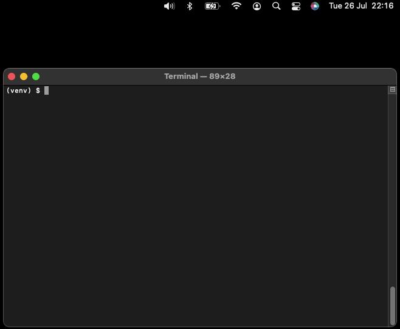

# Mac Notifications
<p align="center">
  <a href="https://jorricks.github.io/macos-notifications"></a>
</p>
<p align="center">
<a href="https://www.apple.com/mac/" target="_blank">
    
</a>
<a href="https://pypi.org/project/macos-notifications" target="_blank">
    
</a>
<a href="https://pypi.org/project/macos-notifications" target="_blank">
    
</a>
</p>

---

**Documentation**: [https://jorricks.github.io/macos-notifications/](https://jorricks.github.io/macos-notifications/)

**Source Code**: [https://github.com/Jorricks/macos-notifications](https://github.com/Jorricks/macos-notifications/)

---

**mac-notification** is a Python library to make it as easy as possible to create interactable notifications.


## Installation
To use macos-notifications, first install it using pip:

<!-- termynal -->
```
$ pip install macos-notifications
---> 100%
Installed
```

## Features
- 🚀 Easy python interface. It's as simple as '`client.create_notification(title="Meeting starts now!", subtitle="Team Standup")`'
- 💥 Ability to add action buttons with callbacks!
- 📝 Ability to reply to notifications!
- ⌚ Delayed notifications.
- ⏱️ Automatically time out the notification listener.
- 📦 Just `pyobjc` as a dependency.


## Example

```python
from functools import partial
from mac_notifications import client

if __name__ == "__main__":
    client.create_notification(
        title="Meeting starts now!",
        subtitle="Team Standup",
        icon="/Users/jorrick/zoom.png",
        sound="Frog",
        action_button_str="Join zoom meeting",
        action_callback=partial(join_zoom_meeting, conf_number=zoom_conf_number)
    )
```
A simple example. Please look [in the docs](https://jorricks.github.io/macos-notifications/) for more examples like this:

<p align="center">
<a href="https://jorricks.github.io/macos-notifications/examples/">

</a>
</p>

## Limitations
- You need to keep your application running while waiting for the callback to happen.
- Currently, we are only supporting the old deprecated [user notifications](https://developer.apple.com/documentation/foundation/nsusernotification). Soon we will also make the new implementation available.
